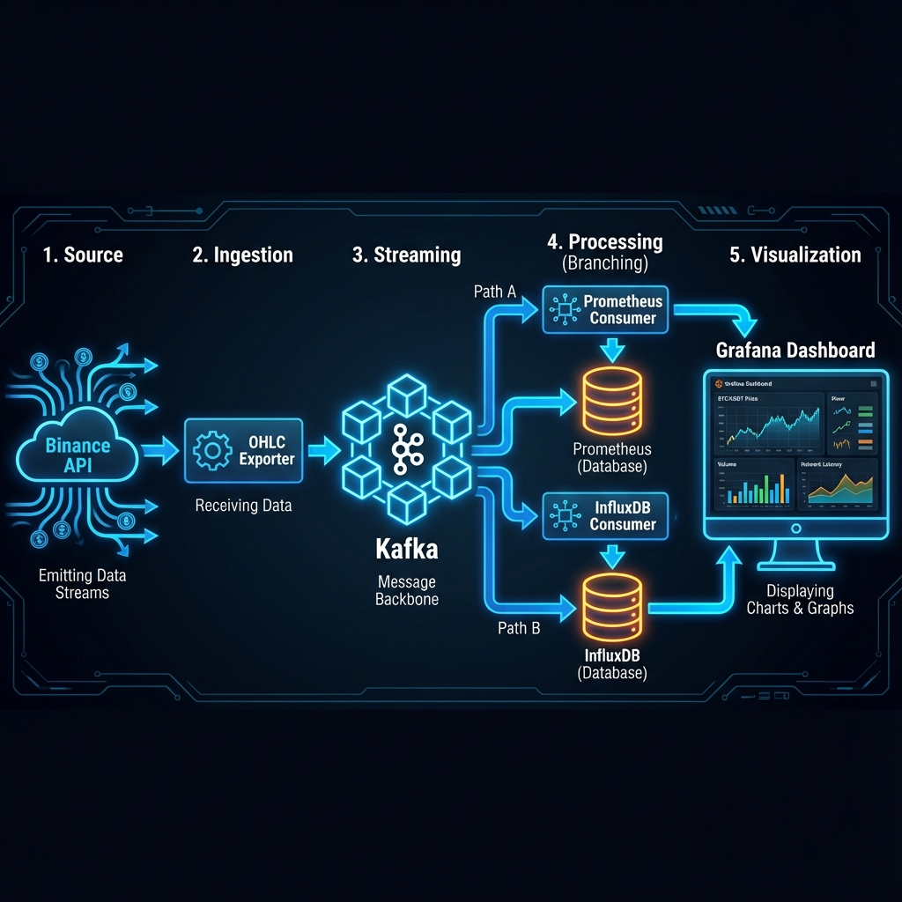

# 🚀 Real-time Cryptocurrency Monitoring Stack

A robust, containerized pipeline for real-time monitoring and historical analysis of cryptocurrency OHLC (Open, High, Low, Close) candle data from Binance.



---

## 🏗️ System Architecture

The pipeline consists of four main stages:

1.  **Ingestion**: `ohlc-exporter` connects to Binance WebSocket API.
2.  **Streaming**: Kafka acts as the central message broker.
3.  **Processing**:
    *   `prometheus-consumer`: Aggregates real-time metrics.
4.  **Visualization**: Grafana dashboards powered by Prometheus.

---

## 🔌 Service Ports

| Service | Port | Description | Credentials |
|---------|------|-------------|-------------|
| **Grafana** | `3000` | Main Dashboard UI | `admin` / `password` |
| **Prometheus** | `9090` | Metrics Query UI | - |
| **Metrics** | `9001` | Raw Consumer Metrics | - |
| **Kafka** | `9092` | Message Broker | - |

---

## 📂 Project Structure & File Descriptions

### Root Directory
*   **`docker-compose.yml`**: The orchestration file. Defines all services, networks, and volumes. Includes profiles to disable Airflow by default to save resources.

### 📡 OHLC Exporter (`ohlc-exporter/`)
*   **`binance_exporter.py`**: The data source. Connects to Binance WebSocket, filters for closed 1-minute candles, and produces JSON messages to Kafka topic `binance_kline`.
*   **`Dockerfile`**: Builds the Python environment for the exporter.

### ⚡ Prometheus Consumer (`prometheus-consumer/`)
*   **`prometheus_consumer.py`**: Real-time processor. Consumes Kafka messages, updates Prometheus Gauge metrics (Price, Volume), and handles connection retries.
*   **`Dockerfile`**: Builds the consumer container.

### 📊 Configuration (`grafana/`, `prometheus/`)
*   **`prometheus/prometheus.yml`**: Configures Prometheus to scrape metrics from the `prometheus-consumer` service.
*   **`grafana/datasources/prometheus.yml`**: Auto-configures Prometheus as a data source in Grafana.
*   **`grafana/provisioning/dashboards/provider.yml`**: Auto-loads dashboards from the local directory.

### 🌪️ Airflow (`airflow/`)
*   **`dags/`**: Directory for Airflow DAGs (Airflow is currently disabled by default).

---

## 🚀 How to Run

### 1. Start the Stack
```bash
docker-compose up -d
```

### 2. Verify Data Flow
*   **Grafana**: [http://localhost:3000](http://localhost:3000)
*   **Prometheus**: [http://localhost:9090](http://localhost:9090)

*   **Kafka**: [http://localhost:9092](http://localhost:9092)


### 3. Stop the Stack
```bash
docker-compose down
```
